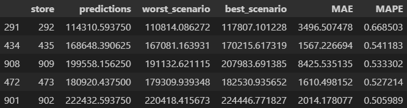
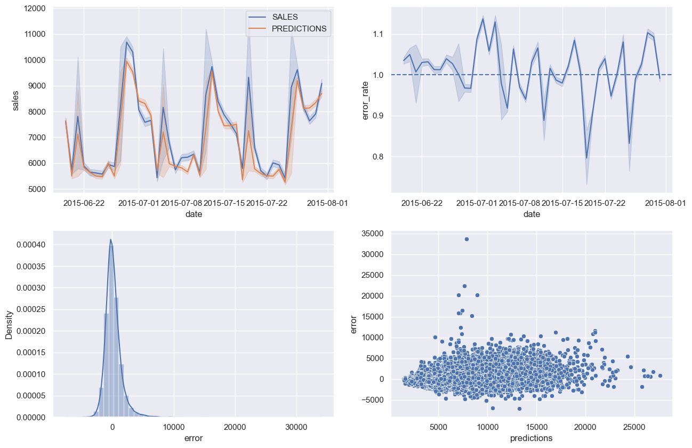

# Rossmann Store Sales Prediction

## 0.0 - Orientações

Os dados utilizados neste projeto de análise preditiva de vendas foram extraídos do [Kaggle: Rossmann Store Sales](https://www.kaggle.com/c/rossmann-store-sales/overview).

A API do projeto em produção foi disponibilizada no [Render](https://render.com/) por meio da url https://rossmann-sales-o2or.onrender.com/rossmann/predict. Disponibilizei também um chatBot no aplicativo Telegram para a previsão de vendas de cada farmácia da rede Rossmann pelo url do Render https://rossmann-telegram-sales.onrender.com .

## 1.0 - Problema de negócio

A Rossmann é uma rede de drogarias, com mais de 3.000 lojas físicas em 7 países europeus. Visando uma melhoria estrutural para melhor atendimento do público, o CFO deseja realizar reformas nas farmácias.

Para poder alocar os recursos de forma eficiente na reforma, ele precisa entender qual a previsão de faturamento de cada loja nas próximas 6 semanas. É um fator determinante para definição do orçamento de cada loja e se, de fato, elas tem condições de realizar essa reforma.

A tarefa foi designada para os gerentes regionais, porém o modelo atual de previsão é manual, apresentando bastante divergência em comparação com as vendas reais. Os gerentes então chamaram a área de Data Science para criar um modelo preditivo mais acurado.

Em resumo, o problema é: fornecer a previsão de vendas das farmácias para as próximas 6 semanas, visando alocação de recursos para reforma das mesmas.

Solução:

1.  Criar um modelo de previsão de vendas por meio de algoritmos de Machine Learning;
2.  ChatBot no Telegram com as previsões para cada loja.

### 1.1 - Ferramentas e Metodologia

Ferramentas utilizadas:

- Python 3.11.7;
- Git e GitHub;
- Jupyter Notebook
- Técnicas de manipulação de dados com bibliotecas Python (pandas, numpy, seaborn)
- Técnicas de redução de dimensionalidade e seleção e atributos;
- Algoritmos de Machine Learning da biblioteca scikit-learn
- Serviço de Hospedagem em Nuvem do Render (Back-End).

Metodologia utilizada para resolução: CRISP-DS

Trata-se de uma metolodiga cíclica para solução de problemas. O responsável passa por cada etapa algumas vezes, sempre aprofundando o conhecimento e ajustando a solução para melhor eficácia em cada ciclo. É composta por 9 passos:

1.  Problema de negócio;
2.  Entendimento do negócio;
3.  Coleta de dados;
4.  Limpeza de dados;
5.  EDA: Análise exploratória dos Dados;
6.  Modelagem dos dados;
7.  Aplicação de Modelos de Machine Learning;
8.  Ajuste de Hiperparâmtros;
9.  Deploy do modelo em produção.;

## 2.0 - Descrição dos dados

Atributos das lojas:

- 'Store': identificador único de cada loja;
- 'StoreType': tipo da loja (a/b/c/d);
- 'Assortment': tipo de sortimento (variedade de produtos) disponibilizado em cada loja (básico, extra ou extendido);
- 'CompetitionDistance': distância em metros da loja concorrente mais próxima;
- 'CompetitionOpenSinceMonth': [Month/Year] indica o ano e mês em que o competidor mais próximo iniciou as atividades;
- 'Promo': valor binário indicando se a loja está com alguma promoção ativa no dia;
- 'Promo2': valor binário indicando se a loja deu continuidade na promoção. Sendo 0 = loja não está participando, 1 = loja participando;
- 'Promo2Since': [Year/Week] mostra o ano e semana quando a loja inicia promo2,
- 'PromoInterval': indica os meses em que a loja esteve a promo2;

Atributos das vendas:

- 'DayOfWeek': variável numérica que indica o dia da semana em que ocorreu a venda;
- 'Date': data da venda;
- 'Customers': quantidade de clientes que entraram na loja na data;
- 'Open': valor binário indicando se loja estava aberta ou não (loja aberta = 1 ou loja fechada = 0);
- 'StateHoliday': Indica se o dia é feriado estadual, sendo: a = Feriado público; b = Feriado de páscoa; c = Natal; 0 = Sem feriado;
- 'SchoolHoliday': indica se a data corresponde a férias escolares ou não (1 = sim; 0 = não).

Variável resposta:

- 'Sales': valor das vendas da loja na data em questão.

## 3.0 - Premissas de análise

Aqui expresso quais variáveis (colunas) foram analisadas e tratadas para a correta realização da análise:

- competition_distance: substituição dos valores NA pelo valor 200.000. Isso significa que a distância do competidor é tão alta que não é relevante;
- competition_open_since_month/year: substituição dos valores NA pela mesma data da coluna 'Date';
- promo2_since_week/year: substituir nulos pela semana/ano referente à coluna 'date';
- promo_interval: substituir nulos por 0;
- Todas as linhas com 'open' == 0 foram retiradas, pois indicam loja fechada;
- Todas as linhas com 'sales' == 0 foram retiradas, pois indicam que não houve vendas no dia;
- A coluna 'customers' foi retirada, uma vez que demandaria uma análise e predição paralela para calcular o volume de clientes na loja nas próximas 6 semanas.

## 4.0 - EDA: Análise Exploratória de Dados

Fiz o levantamente de 12 hipóteses para realização da EDA, objetivando entender melhor o negócio, trazer insights e auxiliar na modelagem de dados e aplicação de algoritmos de Machine Learning. São elas:

| Hipótese | Pergunta                                                       | Resultato      | Relevancia |
| -------- | -------------------------------------------------------------- | -------------- | ---------- |
| H1       | Lojas com maior sortimento deveriam vender mais.               | VERDADEIRA     | BAIXA      |
| H2       | Lojas com competidores mais próximos deveriam vender menos.    | FALSA          | MEDIA      |
| H3       | Lojas com competidores há mais tempo deveriam vender mais.     | FALSA          | MEDIA      |
| H4       | Lojas com promoção ativa por mais tempo deveriam vender mais.  | FALSA          | BAIXA      |
| H5       | <s>Lojas com mais dias de promoção deveriam vender mais.</s>   | próxima rodada | ---        |
| H6       | Lojas com mais promoções consecutivas deveriam vender mais.    | FALSA          | BAIXA      |
| H7       | Lojas abertas durante o feriado de Natal deveriam vender mais. | FALSA          | MEDIA      |
| H8       | Lojas deveriam vender mais ao longo dos anos.                  | FALSA          | ALTA       |
| H9       | Lojas deveriam vender mais no segundo semestre do ano.         | VERDADEIRA     | ALTA       |
| H10      | Lojas deveriam vender mais depois do dia 10 de cada mês.       | FALSO          | ALTA       |
| H11      | Lojas deveriam vender menos aos finais de semana.              | VERDADEIRA     | ALTA       |
| H12      | Lojas deveriam vender menos durante os feriados escolares.     | FALSA          | BAIXA      |

Principais considerações:

- A hipótese 5 foi desconsiderada deste ciclo do CRISP, pois é muito parecida com a hipótese 4 e demoraria muito mais para comprová-la, pois seria necessário derivar todos os dias de promoção por loja e fazer a contagem. Portanto, é melhor deixar para um próximo ciclo do CRISP;
- Na hipótese 7, como ainda não ocorreu o natal em 2015, obviamente as vendas acumuladas no natal são menores. Porém quando ananalisamos a média de vendas diárias, o feriado de Páscoa é o que apresenta maior venda diária, seguido pelo de Natal; os feriados públicos são os que apresentam menores vendas diárias;
- Na hipótese 8, nota-se uma queda de vendas entre 2013 para 2014. O ano de 2015 ainda não está completo, de forma que as vendas são menores, porém nota-se um comportamento de melhora nas vendas;
- Na hipótese 11, as lojas vendem menos nos finais de semana, uma vez que muitas delas fecham nos domingos. Porém, na média de vendas, domingo é o melhor dia de vendas quando as lojas estão abertas.

# 5.0 - Preparação dos dados

- Nas variáveis numéricas que não tinham uma distribuição normal, foi utilizado a técnica de rescalling (com MinMax Scaler e Robust Scaler);
- Nas variáveis categóricas foram aplicadas técnicas de encoding para transformá-las em numéricas (One Hot Encoding, Label Encoder e Ordinal Encoder);
- Foi aplicada a transformação de natureza para as variáveis numéricas com comportamento cíclico (ex: ano e mês);
- Aplicou-se a transformação logarítmica na variável reposta ('sales') para tornar sua distribuição mais próxima da distribuição normal.

## 5.1 - Seleção de Atributos

Para selecionar as variáveis/features foi utilizado o Boruta, um algoritmo que faz o ranking de atributos conforme a relevância de cada um. Para tanto, foi definido como algoritmo regressor a Random Forest. O Boruta então descarta os atributos considerados irrelevantes.

Foi definido também uma base de dados de treino e outra de teste. Esta são as linhas em que a data de venda esteja entre as últimas 6 semanas da base de dados. Enquanto que a base de treino são todas as demais semanas, desde a primeira venda.

# 6.0 - Seleção de Modelo de Machine Learning

Parti da seleção de 05 algoritmos para serem treinados, testados e avaliados. Foram eles:

1. Average Model
2. Linear Regression
3. Linear Regression - Lasso
4. Random Forest Regressor
5. XGBoost Regressor

Foram adotados o MAE (Mean Absolute Error), MAPE (Mean Absolute Percentage Error) como principais formas de avalilar os modelos, uma vez que representam, respectivamente, o erro médio absoluto em relação ao valor real, e a porcentagem do erro médio absoluto em relação ao valor real. Isso torna mais fácil para a equipe de negócio avaliar o melhor e pior cenário. O RMSE (Root Mean Squared Error) também foi calculado para cada um dos modelos, como forma de avaliar a eficácia de cada um.

## 6.1 - Métrica dos Algoritmos

As métricas MAE, MAPE e RMSE de cada algoritmo estão a seguir:

| Index | Model Name                | MAE                | MAPE          | RMSE               |
| ----- | ------------------------- | ------------------ | ------------- | ------------------ |
| 0     | Linear Regression         | 2081.73 +/- 295.63 | 0.3 +/- 0.02  | 2952.52 +/- 468.37 |
| 1     | Linear Regression - Lasso | 2116.38 +/- 341.50 | 0.29 +/- 0.01 | 3057.75 +/- 504.26 |
| 2     | Random Forest Regressor   | 836.61 +/- 217.10  | 0.12 +/- 0.02 | 1254.3 +/- 316.17  |
| 3     | XGBRegressor              | 1859.87 +/- 289.14 | 0.25 +/- 0.01 | 2688.49 +/- 432.73 |

## 6.2 - Escolha do Modelo

O MAPE de 45% do Average Model indicou que se tratava de um problema complexo e, como a variável resposta varia conforme o tempo, temos um problema de série temporal.

Para os demais modelos foi aplicada a ainda a técnica de Cross Validation, possibilitando treinar e testar os modelos com todas as faixas temporais disponíveis.

O modelo inicialmente escolhido pelas melhores métricas de MAE e MAPE foi o Random Forest. Porém é um modelo pesado para ser treinado, além de que o XGB mostrou um erro MAPE de 13% (apenas 1pp maior que o Random Forest) após a tunagem de Hiperparâmetros. O modelo escolhido para seguir com o Modelo foi o XGBoost.

## 6.3 - Tunagem de Hiperparâmetros

O Random Search foi utilizado como técnica de tunagem de Hiperparâmetros, uma vez que apresenta velocidade de processamento muito maior do que a Grid Search (Random Search realiza uma quantidade limitada de interações com base nas possibilidades de parâmetros definidas como base).

Após aplicar a Random Search, foi realizado novamente o treino do modelo usando o Cross-Validation, desta vez com os melhores parâmetros adquiridos pela tunagem.

## 6.4 - Métricas do Modelo Final

A seguir os valores finais obtidos após a tunagem:

| Index | Model Name   | MAE      | MAPE   | RMSE      |
| ----- | ------------ | -------- | ------ | --------- |
| 0     | XGBRegressor | 921.53   | 0.1386 | 1332.1000 |

# 7.0 - Resultado: performance do projeto

Como estamos lidando com um modelo de Série Temporal, não avaliamos a acurácia do modelo, e sim o erro obtido. Do ponto de vista do negócio, o desempenho do modelo foi demonstrado pelas métricas do MAE e MAPE para cada loja. Também foi traçado o melhor e pior cenário de previsões para embasar a decisão pelo time de negócio.

Foram também ordenadas as lojas com os maiores erros percentuais médios absolutos, uma vez que são considerados 'outliers', e o modelo não consegue prever o fenômeno de maneira adequada.

## 7.1 - Performance Financeira

Abaixo os valores totais das previsões, assim como o melhor e pior cenário.

| Index | cenarios       | values           |
| ----- | -------------- | ---------------- |
| 0     | Previsões      | R$283,399,840.00 |
| 1     | Pior Cenário   | R$282,370,061.34 |
| 2     | Melhor Cenário | R$284,429,652.43 |

## 7.2 - Lojas com maior MAPE

## 7.3 - Gráficos de desempenho

A figura abaixo mostra 4 gráficos de desempenho que foram traçados para análise de desempenho.

1. O gráfico superior esquerdo mostra a
   visão comparativa semanal dos valores previstos pelo modelo (em laranja) e as vendas reais (em azul) das últimas 6 semanas de vendas (base de teste);
2. O gráfico superior direito indica se as previsões estão superestimadas (acima de 1) ou subestimadas (abaixo de 1). Nota-se que a grande parte das previsões estão entre 0,95 e 1,05;
3. O gráfico inferior esquerdo mostra a distribuição de erro do modelo. Como é uma distribuição próxima de uma normal, concluímos que ele apresenta erros pouco significativos.
4. O gráfico do canto inferior direito mostra a dispersão dos erros do modelo em forma tubular. Nota-se a grande concentração ao redor de 0, havendo poucos outliers. Estes, no entanto, podem ser estudados mais a fundo em um segundo ciclo do CRISP.

# 8.0 - Modelo em Produção

Após finalização do modelo, ele foi colocado em produção na nuvem pelo [Render] e está disponível no url https://rossmann-sales-o2or.onrender.com/rossmann/predict com um serviço de API desenvolvido em Flask.

Foi desenvolvido também um ChatBot no Telegram (aplciativo de trocas de mensagens), de modo que o CFO pode digitar o número da loja e ele retorna a previsão para as próximas 6 semanas. O url do bot é https://rossmann-telegram-sales.onrender.com.

## 8.1 - Conclusão

Foi possível colocar o modelo em Produção logo no primeiro Ciclo do CRISP, uma vez que o nível de erro obtido foi satisfatório. O CFO já possui uma solução para poder realizar o planejamento financeiro. Certamente há melhorias a serem realizadas nos próximos ciclos do CRISP.

# 9.0 - Próximos passos

Defino como próximos passos prioritários:

1. Aprofundamento das lojas outliers (acima de 25% de MAPE). Existe a possibilidade de precisar desenvolver um novo modelo exclusivo para elas;
2. Desenvolver e testar novas hipóteses junto com o time de negócios, a fim de obter novos insights importantes;
3. Testar novos algoritmos de regressão e/ou alterar os hiperparametros do modelo XGBoost, afim de reduzir o erro do modelo;
